# Full-Glow
This repo contains the implementation of *Full-Glow: Fully conditional Glow for more realistic image generation*:
[https://arxiv.org/abs/2012.05846](https://arxiv.org/abs/2012.05846). A short presentation of the work could be seen [here](https://www.youtube.com/watch?v=lbvYIJIczjU).

Full-Glow extends on previous Glow-based models for conditional image generation by applying conditioning to all Glow operations 
using appropriate conditioning networks. It was applied to the [Cityscapes](https://www.cityscapes-dataset.com/) dataset (label &#8594; photo) for synthesizing street-scene images.


## Quantitative results
Full-Glow was evaluated quantitatively against previous Glow-based models ([C-Glow](https://arxiv.org/abs/1905.13288) and [DUAL-Glow](https://pitt.edu/~sjh95/teaching/related_papers/dual_glow.pdf)) along with the GAN-based model [pix2pix](https://github.com/junyanz/pytorch-CycleGAN-and-pix2pix) using the [PSPNet](https://github.com/hszhao/semseg)
classifier. With each trained model, we did inference on the Cityscapes validation set 3 times and calculated the PSP scores.

| Model          | Conditional BPD &#8595; | Mean pixel acc. &#8593; | Mean class acc. &#8593; | Mean class IoU  &#8593; |
| -------------- | ----------------------- | ----------------------- | ----------------------- | ----------------------- |
| C-Glow v.1     | 2.568                   | 35.02 ± 0.56            | 12.15 ± 0.05            | 7.33 ± 0.09             |
| C-Glow v.2     | 2.363                   | 52.33 ± 0.46            | 17.37 ± 0.21            | 12.31 ± 0.24            |
| Dual-Glow      | 2.585                   | 71.44 ± 0.03            | 23.91 ± 0.19            | 18.96 ± 0.17            |
| pix2pix        | ---                     | 60.56 ± 0.11            | 22.64 ± 0.21            | 16.42 ± 0.06            |
| **Full-Glow**  | **2.345**               | **73.50 ± 0.13**        | **29.13 ± 0.39**        | **23.86 ± 0.30**        |
| *Ground-truth* | *---*                   | *95.97*                 | *84.31*                 | *77.30*                 |


## Visual samples in 512x1024 resolution (please zoom to see more details)
<pre>
                          Condition                        Synthesized
</pre>

<p align="middle">
  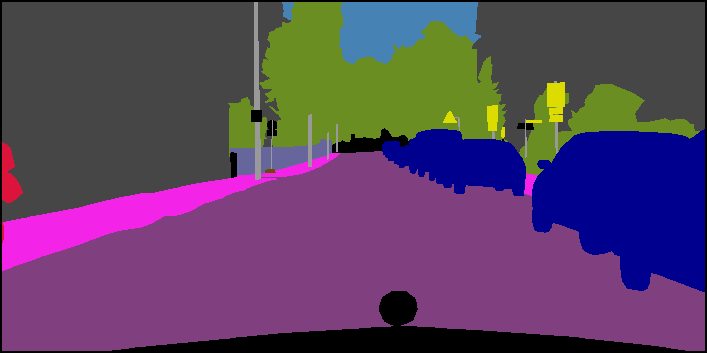
  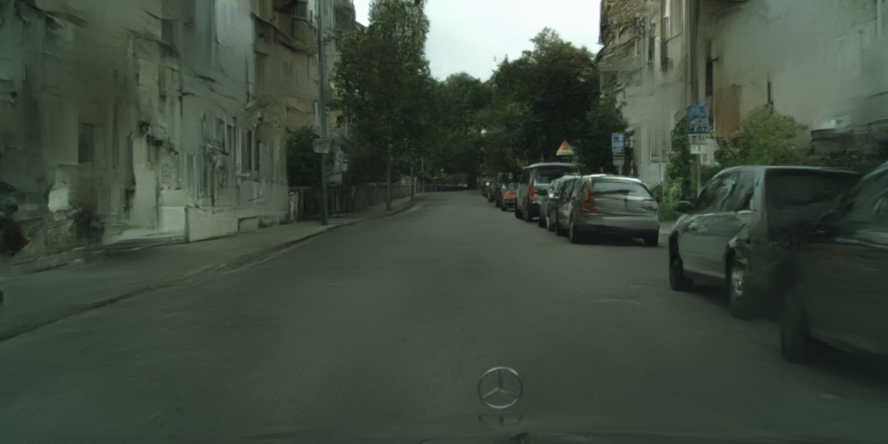
</p>

<p align="middle">
  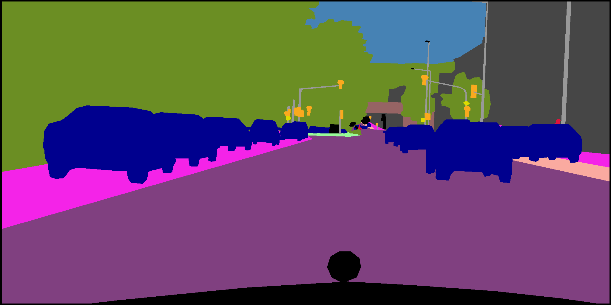
  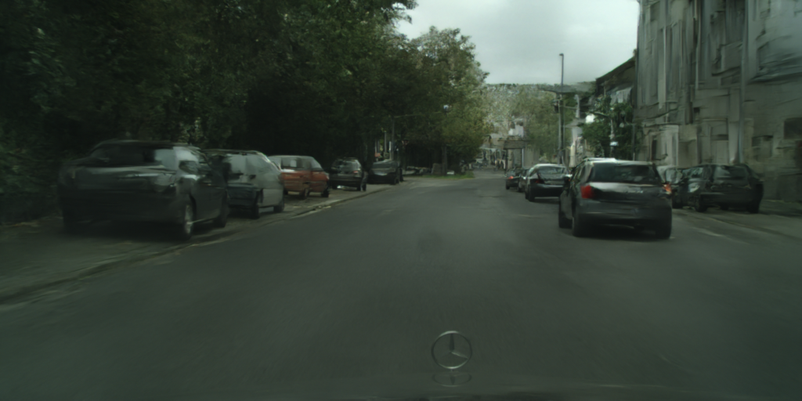
</p>

<p align="middle">
  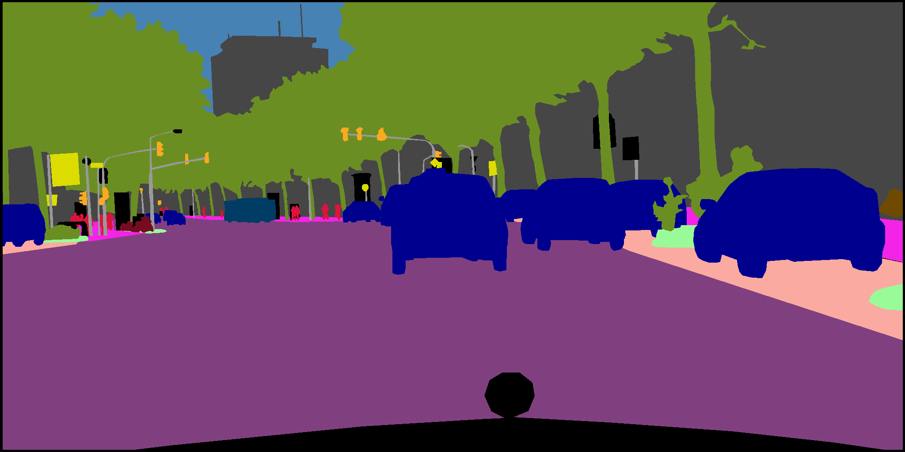
  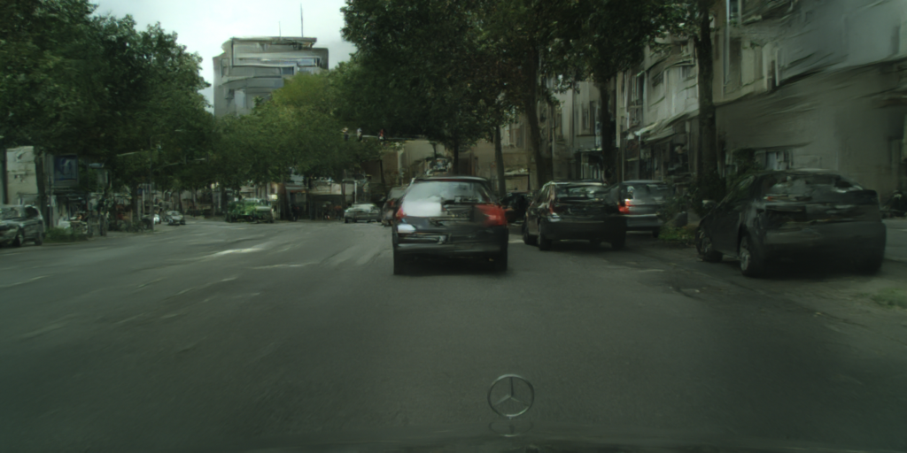
</p>

<p align="middle">
  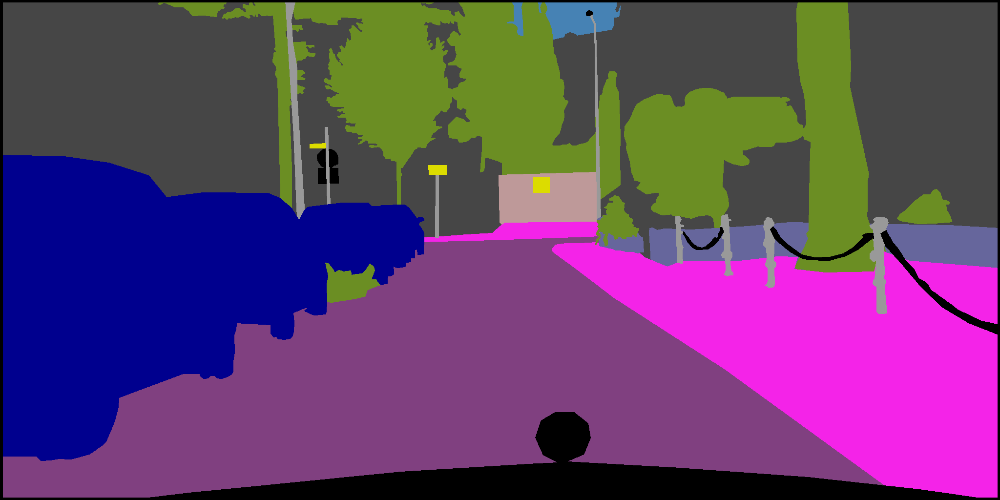
  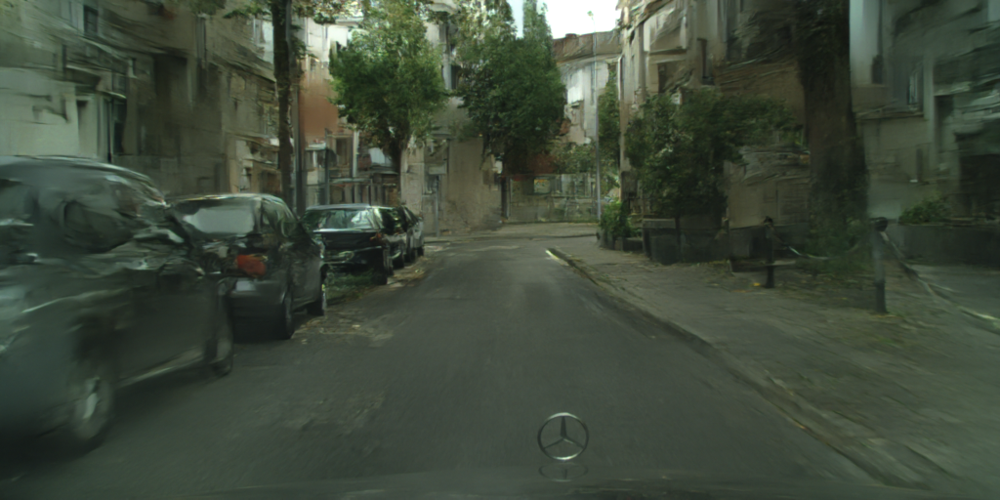
</p>

<p align="middle">
  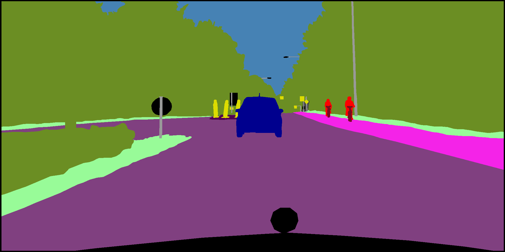
  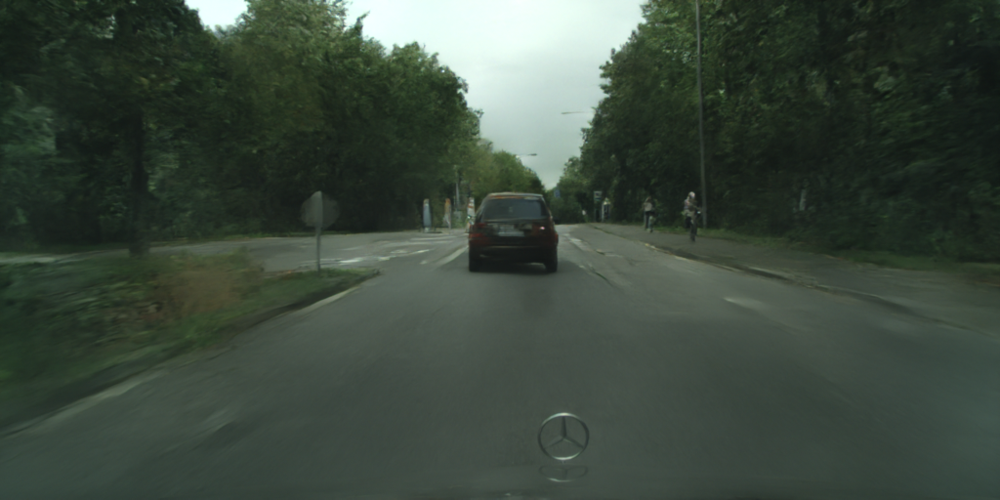
</p>

<p align="middle">
  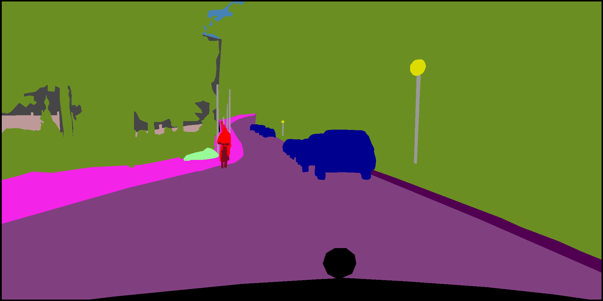
  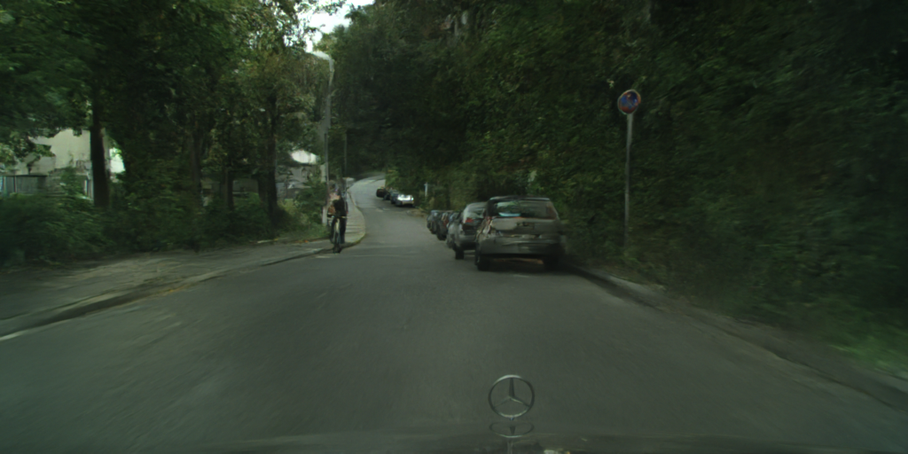
</p>

<p align="middle">
  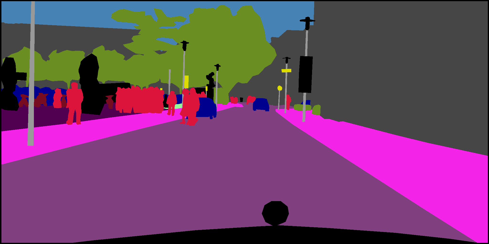
  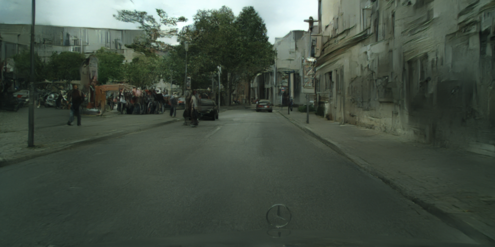
</p>


## Visual examples of content transfer (please zoom to see more details)
Images from left to right: Desired content - Desired structure - Content applied to structure - Ground-truth for structure

<p align="middle">
  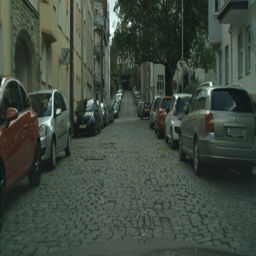
  
  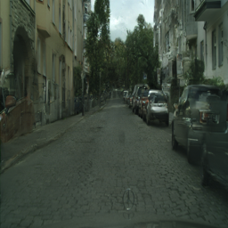
  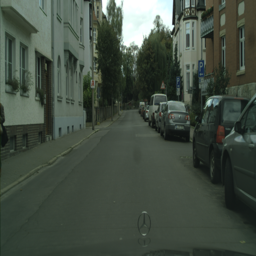
</p>

<p align="middle">
  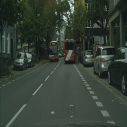
  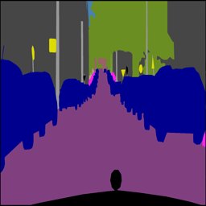
  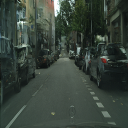
  
</p>

<p align="middle">
  
  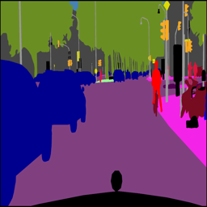
  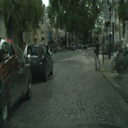
  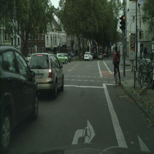
</p>

## Samples generated on the [maps](https://github.com/junyanz/pytorch-CycleGAN-and-pix2pix/blob/master/datasets/download_pix2pix_dataset.sh) dataset
<pre>Top row: Condition, Bottom row: synthesized </pre>
<p align="middle">
  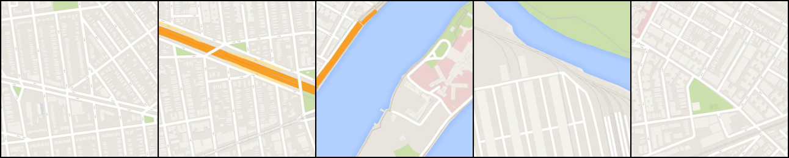
   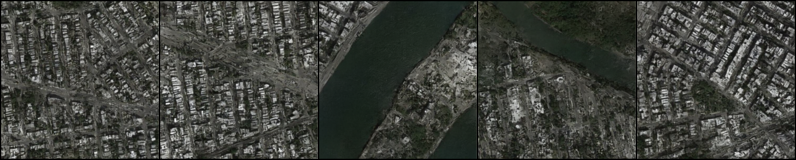
</p>

<pre>Top row: Condition, Bottom row: synthesized </pre>
<p align="middle">
  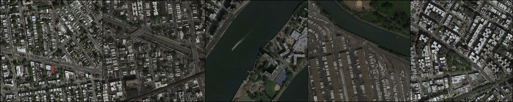
   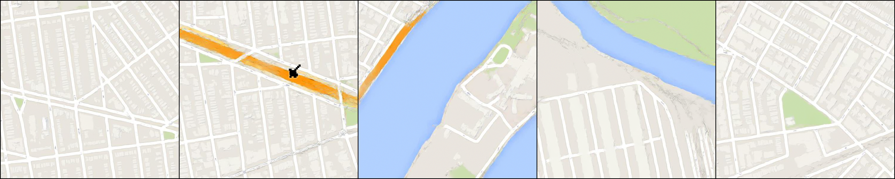
</p>


## Training
To train a model on e.g. Cityscapes, one can run:  
`python3 main.py --model improved_so_large_longer --img_size 512 1024 --dataset cityscapes --direction label2photo 
   --n_block 4 --n_flow 8 8 8 8 --do_lu --reg_factor 0.0001 --grad_checkpoint`  
### Arguments
- `--model` indicates the name of the model (should have 'improved' in the name to enable training Full-Glow)
- `--dataset` determines which dataset to choose. Dataloaders for the Cityscapes, MNIST, and maps datasets are already implemented here
- `--do_lu` enables the use of LU decomposition which has a noticeable effect on training time  
- `--reg_factor` indicates the regularizer applied to the right-hand side of the objective function  
- `--grad_checkpoint` enables use of [gradient checkpointing](https://github.com/cybertronai/gradient-checkpointing) which is needed here for training on larger images

## Description of packages in the project
- `data_handler` contains implementation of data loaders for different datasets
- `evaluation` contains code for evaluating the models
- `experiments` has code for experiments such as content transfer and sampling
- `helper` contains implementation of helper functions for dealing with files, directories, saving/loading checkpoints etc.
- `models` contains implementation of Full-Glow, DUAL-Glow, and C-Glow
- `trainer` has implementation of the training loop and loss function

## Checkpoints
Checkpoints for all the Cityscapes models trained in this project (including C-Glow and DUAL-Glow) can be found here: https://kth.box.com/s/h3r9jt5pq8itrnkp0t2qy11pui7u6dmc


## Notes
- My implementation of the baseline Glow borrows heavily from Kim Seonghyeon's helpful implementation: https://github.com/rosinality/glow-pytorch

## Citation
If you use our code or build on our method, please cite our paper:
```
@inproceedings{sorkhei2021full,
  author={Sorkhei, Moein and Henter, Gustav Eje and Kjellstr{\"o}m, Hedvig},
  title={Full-{G}low: {F}ully conditional {G}low for more realistic image generation},
  booktitle={Proceedings of the DAGM German Conference on Pattern Recognition (GCPR)},
  volume={43},
  month={Oct.},
  year={2021}
}
```
